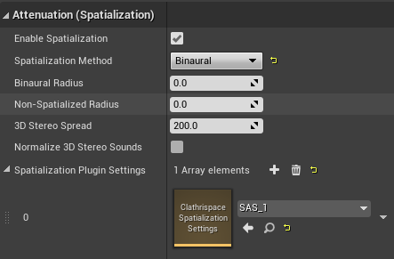
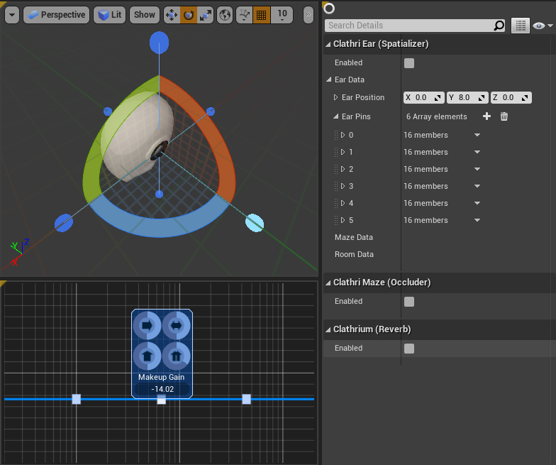

Clathrispace
============

Clathrispace is attenuator which allows you to make sound more psychoacoustically corrent without loss of artistical aspect of sound field. It may be useful in games because games doesn't offer proper sound for the benefit of clarity. ClathriEar is spatialization feature involved in this pipeline to extend binaural audio with filter pins. Every filter pin equipped with 3 filters and it lets you make some spectral reconstruction of perception of human ear. 

How to use it?
--------------

### Asset creation

After you [installed plugin](installation_guide.md) in your environment, ensure you have created sound attenuation. To make sound attenuation, right click in Content Browser, select __Sounds ➔ Sound Attenuation__. Open created asset and go to __Attenuation__ section and create new __Spatialization Plugin Settings__ by clicking plus button. Assign existing __Clathrispace Spatialization Settings__ or press __Clathrispace Spatialization Settings__ in __Create New Asset__ section to create new one. Then press __Save Asset__ button in toolbar. 

### Enabling advanced spatialization

In __Sound Attenuation__ asset editor look at __Attenuation (Spatialization)__ section and ensure that checkbox __Enable Spatialization__ is on. Set __Spatialization Method__ as __Binaural__ instead of __Panning__. 

### Settings

From __Attenuation (Spatialization)__ asset double click at __Clathrispace Spatialization Settings__ icon or double click it in asset browser to open asset editor. By default, you will see standard mannequin head with six filter pins. 

### Filter pins (spectral reconstruction)

Every pin may be rotated if you select it and drag with the transformation 3D widget. This pin is corresponding to sound direction and it may be attenuated with spectral adjustment. All other directions will be average between neightbour pins and will depend on angular distance. Filter pins is tool to achieve spectral correction of sound from certain direction. 

### Ear position (phase reconstruction)

In other hand, you have setting named __Ear Position__. If length of this vector is zero, that means no binaural effect is applied. If this length is more than 8cm, phase shift will be longer and this setting will emulate perception of heads bigger than humanoid head, which may be used not as technical but artistical technique like Doppler shift or chewed-up tape.

[Return to main page](index.md)

