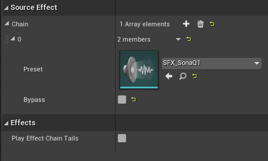
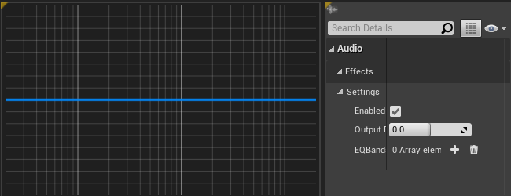
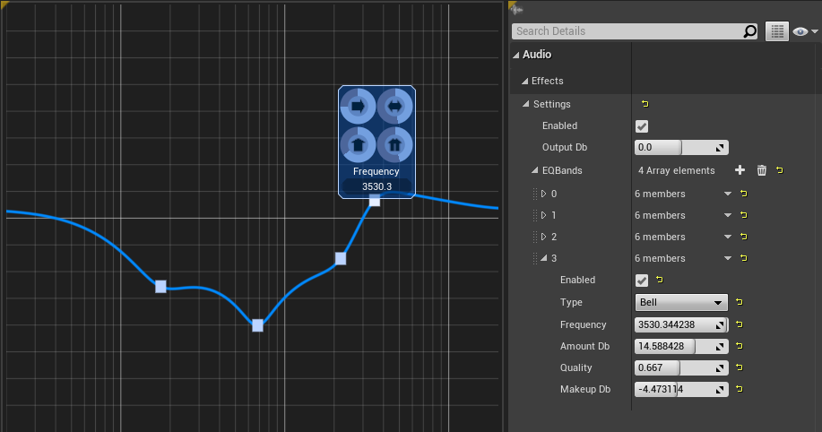

SonaQ
=====

SonaQ module is an Parametric EQ with visualizer which helps you to understand better what are you gonna do. At this moment it doesn't offer spectrum analyzer like modern EQ plugins do it for DAW, but it gives you new level of control and comprehension. 

No reason to treat realtime effects as they are. Many of them may be baked into your game assets in DAW or with WWise, FMOD or similar software. Source effects may be excellent diagnostic tool or they may be applied in cases when precalculated sounds won't help. 

How to use it?
--------------

### Asset creation

After you [installed plugin](installation_guide.md) in your environment, ensure you have created source effect chain. Technically, __SonaQ__ is source effect and you have to create source effect preset which will be item of source effect chain preset. 
To make new source effect preset chain, right click in Content Browser, select __Sounds ➔ Effects ➔ Source Effect Preset Chain__. Then create new source effect preset. To do it, right click in Content Browser, select __Sounds ➔ Effects ➔ Source Effect Preset__. In source effect preset chain in __Source Effect__ section in __Chain__ property click plus button. Then select preset you have created and press __Save Asset__ button in toolbar. Ensure __Bypass__ checkbox is disabled. 

### Binding effect preset with sounds

In Unreal Engine sound assets are __sound waves__ and __sound cues__. Both of them have the same interface to use realtime effects. In __Details__ panel in __Effects__ section choose source effect chain you have created. 

### Monitoring the applying effect

After you have bound effect with your sound asset, open the effect itself. Asset editor will be shown, where by default the only tab will contain flat frequency response graph. The first fat vertical line is corresponding to 100Hz, the second — to 1kHz, the third — to 10kHz. If you want to see legacy __Details__ panel, click __Window ➔ Details__ to dock it at right side. 

Add some control points to graph by double clicking it. This control point will be bound to certain parametric EQ band. Type of created band will depend on place you clicked twice. If this frequency is less than 100Hz (to the left from the first fat vertical line), __Low shelf__ filter will be created. If you clicked twice at frequency more than 4.4kHz, __High shelf__ filter will be created. In all other cases you will create __Bell__ filter. You can also change type of filter by dragging upper left knob of band popup, where band popup is square widget following the band, which will be described later in this document. Then try to drag control point up and down, left and right, which means you will change amount of filter and frequency of filter accordingly. By holding control button and dragging control point you will change quality (bandwidth) of filter. 

### Auto make-up output gain

When you dragged control points, may be you paid attention that your graph flew up and down to try to preserve constant perceived loudness. To bypass this feature you have two options:
- Hold alt key when you drag points. 
- Use text input in band popup. 

### Band popup

Band popup is widget which always will follow your band and saves space on your screen. It contains four multifunctional knobs: __Frequency__, __Amount__, __Quality__, __Makeup__. Inside each of them you can find navel buttons, — combos of toggle button and one more knob. The functions of every knob is described below: 

Position    | Outer knob     | Inner knob  | Toggle button
------------|----------------|-------------|--------------
Upper left  | Frequency (Hz) | Listen      | _No action_
Lower left  | Amount (dB)    | Band type   | _No action_
Upper right | Quality (Q)    | Quality (Q) | Remove band
Lower right | Makeup (dB)    | Makeup (dB) | Toggle band

### Listen

When you drag frequency inner knob you can filter out other frequencies to explore problem easier. Until you drop the navel button band filter with corresponding quality will be applied to your sound. 

Press Play on sound asset thumbnail and listen to difference. Enjoy!

[Return to main page](index.md)

